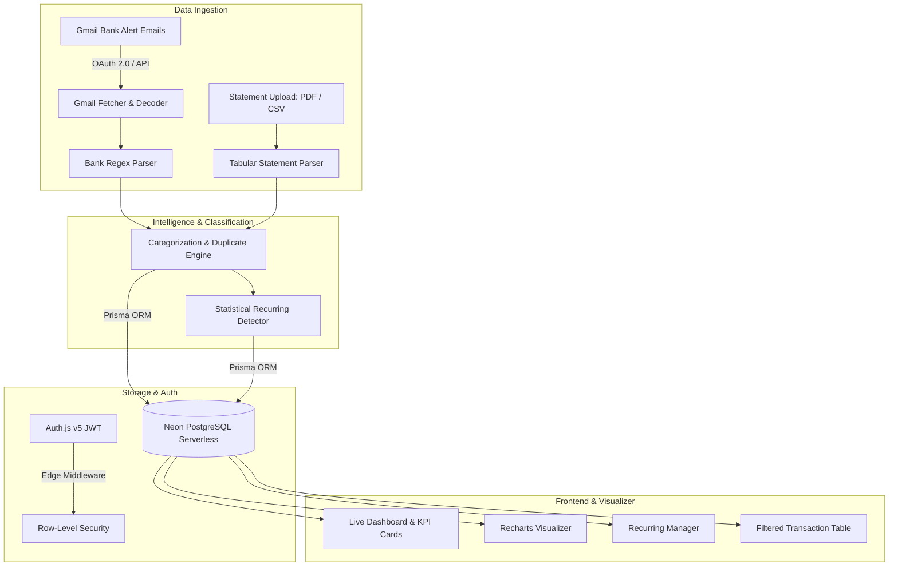

# FinPulse — Intelligent Personal Finance & Wealth Platform

<div align="center">


**Full-Stack Personal Finance Platform with Automated Gmail Ingestion, PDF/CSV Statement Parsing, and Deep Spending Analytics.**

[](https://finpulse-ai-dev.vercel.app)
[](https://nextjs.org/)
[](https://react.dev/)
[](https://www.typescriptlang.org/)
[](https://tailwindcss.com/)
[](https://www.prisma.io/)
[](https://neon.tech/)

</div>

---

## 🌟 Overview

**FinPulse** is a personal finance and expense intelligence application designed to eliminate tedious manual tracking. It bridges the gap between bank notifications and spending clarity through automated Gmail synchronization, statement extraction, recurring bill detection, and interactive visual analytics.

---

## 🚀 Key Features

### 1. 📬 Automated Gmail Bank Ingestion
- **One-Click Google OAuth 2.0**: Securely links your Gmail with read-only scopes (`gmail.readonly`) restricted strictly to financial senders.
- **Smart Bank Alert Parser**: Custom regex extraction engine recognizing notification templates from **HDFC, ICICI, SBI, Axis, Kotak, IndusInd, Yes Bank, UPI (GPay, PhonePe, Paytm), and CRED**.
- **Customizable Sync Timeframes**: Choose sync windows (`Current Month`, `Last 7 Days`, `Last 15 Days`, `Last 30 Days`, `Last 3 Months`, `Last 6 Months`, `Last 1 Year`).
- **Zero Duplicates**: Indexed by unique Gmail `emailMessageId` so you can sync repeatedly without data pollution.

### 2. 📄 Bank Statement Parser (PDF & CSV)
- Drag-and-drop file upload for official bank statement exports.
- Tabular extraction supporting multi-column transaction formats (Debit/Credit/Balance).
- Pre-import preview table allowing instant category editing and duplicate inspection before committing to the database.

### 3. 🔄 Recurring Subscriptions & Income Engine
- Statistical algorithm combining **merchant string cosine similarity** and **interval regularity** to automatically detect:
  - Streaming subscriptions (Netflix, Spotify, YouTube Premium)
  - Utility bills (Electricity, Broadband, Mobile Recharge)
  - Rent, Loan EMIs, and monthly Salary credits
- Frequency tracking (Weekly, Bi-weekly, Monthly, Quarterly, Yearly) with next estimated billing dates.

### 4. 📊 Deep Financial Analytics & Visualizer
- **Executive KPI Cards**: 6-month aggregate spend, monthly average, savings rate %, and highest spend day.
- **Income vs. Expenses**: Monthly comparative trend analysis.
- **Cumulative Net Savings Curve**: Visual area gradient mapping net cash flow over time.
- **Weekday Spend Heatmap**: Day-of-week bar chart analyzing spending behavior across 90-day rolling windows.
- **Top Merchant Ranking**: Spend volume distribution with dynamic progress bars.

### 5. 🔒 Data Sovereignty & Export
- **One-Click CSV Export**: Download complete dated transaction archives with category tags.
- **Danger Zone**: Instant two-step transactional wipe to reset account state whenever desired.
- **Row-Level Security**: Complete multi-tenant user isolation.

---

## 🏗️ System Architecture



---

## 🛠️ Tech Stack

| Layer | Technologies |
|---|---|
| **Framework** | Next.js 16 (App Router), React 19 |
| **Language & Styling** | TypeScript 5, Tailwind CSS v4, CSS Variables |
| **Database & ORM** | Neon Serverless PostgreSQL, Prisma ORM 7 |
| **Authentication** | Auth.js / NextAuth v5 (Edge-compatible JWT Strategy) |
| **Third-Party APIs** | Google OAuth 2.0, Gmail API v1 (`googleapis`) |
| **Visualizations** | Recharts, Lucide React Icons |
| **File Parsing** | `pdf-parse`, custom CSV Stream Tokenizer |
| **Deployment** | Vercel (Edge Middleware + Serverless Functions) |

---

## ⚙️ Getting Started Locally

### 1. Clone the Repository
```bash
git clone https://github.com/vineshSarathyOfficial/ai-finance-manager.git
cd ai-finance-manager
```

### 2. Install Dependencies
```bash
npm install
```

### 3. Configure Environment Variables
Create a `.env` file in the root directory:

```env
# Database (Neon PostgreSQL)
DATABASE_URL="postgresql://<user>:<password>@<host>.neon.tech/<dbname>?sslmode=require"
DIRECT_URL="postgresql://<user>:<password>@<host>.neon.tech/<dbname>?sslmode=require"

# Auth.js (NextAuth v5)
AUTH_SECRET="generate-with-openssl-rand-base64-32"
AUTH_URL="http://localhost:3000"
NEXTAUTH_URL="http://localhost:3000"

# Google OAuth & Gmail Sync (From Google Cloud Console)
GOOGLE_CLIENT_ID="your-client-id.apps.googleusercontent.com"
GOOGLE_CLIENT_SECRET="your-client-secret"
```

### 4. Push Database Schema
```bash
npx prisma db push
```

Default categories are created automatically when a user registers.

### 5. Start Development Server
```bash
npm run dev
```

Open [http://localhost:3000](http://localhost:3000) in your browser.

---

## ☁️ Google Cloud Setup (For Gmail Sync)

1. Open the [Google Cloud Console](https://console.cloud.google.com/).
2. Create a project and enable the **Gmail API**.
3. Under **OAuth consent screen**:
   - Set User Type to **External**.
   - Add scopes: `https://www.googleapis.com/auth/gmail.readonly` and `.../auth/userinfo.email`.
   - Add your test email under **Test users**.
4. Under **Credentials** → **Create Credentials** → **OAuth client ID**:
   - Application type: **Web application**
   - Authorized redirect URIs:
     - `http://localhost:3000/api/gmail/callback` (Local development)
     - `https://your-domain.vercel.app/api/gmail/callback` (Production)
   - Authorized JavaScript origins:
     - `http://localhost:3000`
     - `https://your-domain.vercel.app`

---

## 🚀 Deployment (Vercel)

1. Push your repository to GitHub.
2. Import the repository into [Vercel](https://vercel.com).
3. Add the environment variables (`DATABASE_URL`, `DIRECT_URL`, `AUTH_SECRET`, `AUTH_URL`, `NEXTAUTH_URL`, `GOOGLE_CLIENT_ID`, `GOOGLE_CLIENT_SECRET`).
4. Vercel will automatically run `npm run build` and deploy your app.

---

## 📄 License

This project is open-source and available under the [MIT License](LICENSE).
